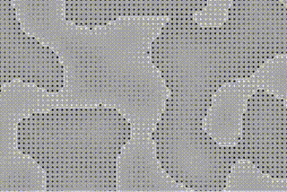

# Marching Squares Exercise
Build with pixi.js and written in typescript.
Based on the [coding challenge](https://github.com/CodingTrain/website/blob/master/challenges/coding-in-the-cabana/005_marching_squares/Processing/sketch_marching_squares/sketch_marching_squares.pde) from coding train.
```bash
# install dependencies 
npm i

# run in dev mode (w/ hot reload)
npm run dev

# serve application
npm start

# build
npm run build
```


